# 🎮 RexGames 쇼핑몰 마이크로서비스 아키텍처 (MSA)

본 문서는 **RexGames 게임 코드 쇼핑몰** 프로젝트의 마이크로서비스 아키텍처(MSA) 설계, 공용 인프라 인프라스트럭처, 그리고 핵심 비즈니스 흐름(주문 및 결제 동시성 제어)을 시각화하여 발표용으로 구성한 README입니다.

---

## 🏗️ 1. 전체 서비스 아키텍처 개요 (Architecture Diagram)

Nginx 역프록시(Gateway)를 통해 각 서비스로 라우팅되며, 서비스 간 비동기 데이터 동기화는 **Kafka Event Bus**를 사용합니다. 데이터베이스는 서비스별로 독립적(Database-per-Service)으로 격리되어 있습니다.

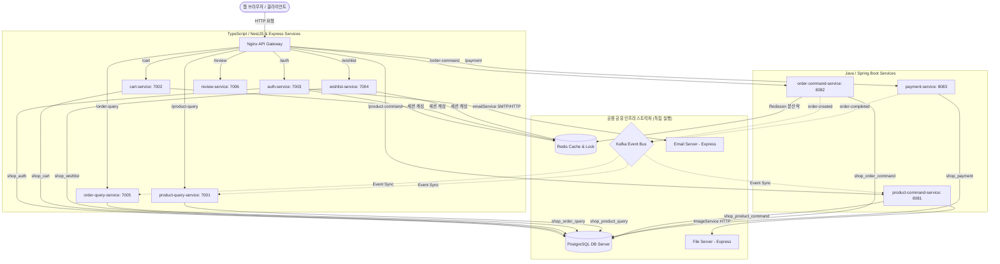

---

## 🧩 2. 마이크로서비스 및 공용 시스템 목록

### 1) 마이크로서비스 (Microservices)

| 서비스명                      | 기술 스택    | 포트   | 주요 역할 및 책임                                                                                                                                    |
| :---------------------------- | :----------- | :----- | :--------------------------------------------------------------------------------------------------------------------------------------------------- |
| **`auth-service`**            | NestJS       | `7003` | 로컬/소셜 회원가입 및 로그인, JWT 토큰 발급/갱신, 공용 **이메일 서버**로 인증 링크 전송                                                              |
| **`cart-service`**            | NestJS       | `7002` | 사용자 장바구니 추가, 조회 및 삭제 처리                                                                                                              |
| **`wishlist-service`**        | NestJS       | `7004` | 찜하기 상품 관리 및 조회                                                                                                                             |
| **`review-service`**          | NestJS       | `7006` | 상품 리뷰 작성 및 별점 관리                                                                                                                          |
| **`product-query-service`**   | Express (TS) | `7001` | 상품 목록 및 디테일 데이터 조회 (CQRS Read-model)                                                                                                    |
| **`order-query-service`**     | NestJS       | `7005` | 주문 내역 조회 및 결제 상태 조회 (CQRS Read-model)                                                                                                   |
| **`product-command-service`** | Spring Boot  | `8081` | 상품 등록/수정/재고 복구, 공용 **파일 서버** 연동(이미지 업로드), 게임코드 자동 생성                                                                 |
| **`order-command-service`**   | Spring Boot  | `8082` | 주문 접수, **Redisson 분산 락** 기반 재고 선점, 주문 상태(`PENDING_PAYMENT`) 관리, **미결제 주문 자동 취소 스케줄러 (`OrderTimeoutScheduler`)** 내장 |
| **`payment-service`**         | Spring Boot  | `8083` | Toss Payments 연동을 통한 결제 승인, 결제 완료 이벤트 발행                                                                                           |

---

### 2) 외부 공용 공유 인프라스트럭처 (Shared Infrastructure)

모든 개별 프로젝트 및 마이크로서비스들이 공통으로 활용하는 독립 인프라입니다.

- **PostgreSQL (RDBMS)**: `Database-per-Service` 원칙 하에 각 서비스별로 독립된 스키마/데이터베이스를 제공하여 결합도를 최소화합니다.
- **Redis (In-Memory Key-Value)**: 세션 저장 및 고성능 캐싱 외에도, 주문 생성 시 **Redisson을 이용한 대용량 동시성 제어용 분산 락** 핵심 서버 역할을 담당합니다.
- **Apache Kafka (Event Broker)**: 주문 생성, 결제 승인, 취소 등 핵심 도메인 이벤트를 비동기로 중계하여 최종 일관성(Eventual Consistency)을 달성합니다.
- **File Server (Express)**: 이미지 리소스 통합 관리 서버입니다. `product-command-service` 등에서 `ImageService` 호출 시 내부 REST API를 통해 멀티파트 업로드 및 URL 반환을 처리합니다.
- **Email Server (Express)**: 메일 전송 대행 서버입니다. `auth-service` 회원가입 시 인증 메일을 발송하기 위해 `emailService` REST API를 호출하면 비동기로 SMTP 발송을 대행합니다.

---

## 🔄 3. 회원가입 및 인증 핵심 흐름 (Registration Flow)

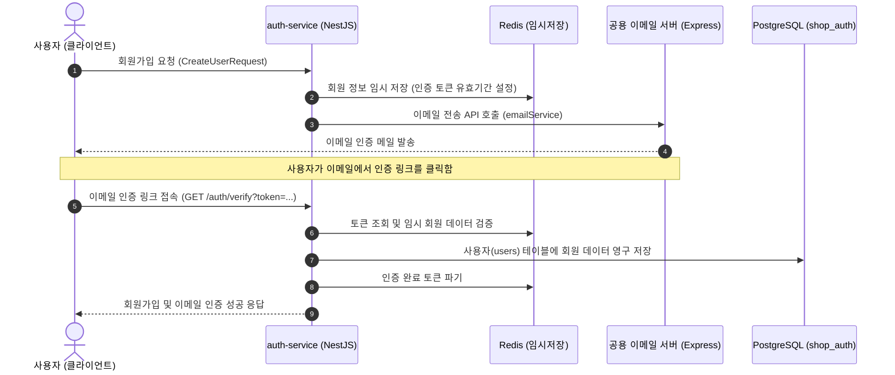

---

## ⚡ 4. 주문/결제 및 동시성 제어 흐름 (Order-to-Payment Flow)

수백 명의 사용자가 동시에 구매를 요청할 때 재고 손실 및 초과 판매(Over-selling) 문제를 예방하기 위해, **Redisson 분산 락(Distributed Lock)**으로 비즈니스 로직을 동기화하고 카프카 이벤트를 통해 최종 상태를 공유합니다.

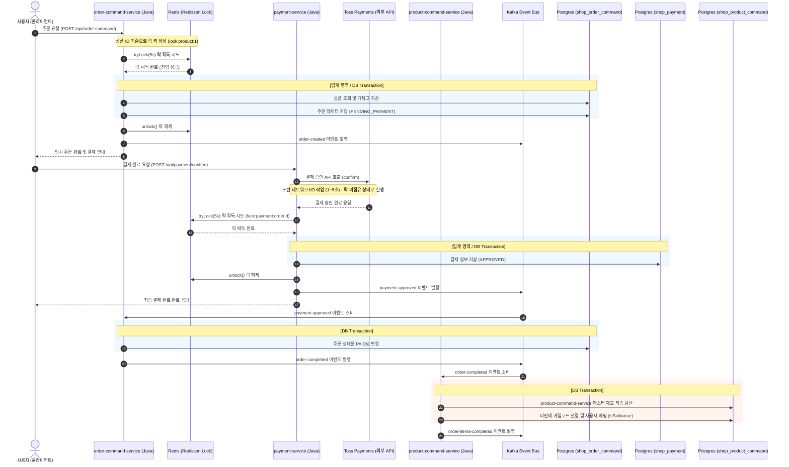

---

## ⚡ 5. CQRS 패턴 및 읽기 성능 최적화 (CQRS & Read Optimization)

본 프로젝트는 대형 이커머스에서 필수적으로 채택하는 **CQRS (Command Query Responsibility Segregation, 명령과 조회 책임 분리)** 패턴을 적용하고 읽기 전용 서비스를 대폭 최적화하여 설계 완성도를 높였습니다.

### 💡 CQRS 패턴이란?

데이터베이스의 **상태를 변경하는 작업(Command / Write / CUD)**과 **상태를 조회하는 작업(Query / Read)**의 데이터 모델 및 서비스 레이어를 독립적으로 분리하는 아키텍처 패턴입니다.

- **도입 배경**: 쇼핑몰 트래픽은 **조회(Query) 작업이 전체의 90% 이상**을 차지하고, 실제 주문/결제와 같은 쓰기(Command) 작업은 상대적으로 드뭅니다. 단일 데이터베이스와 결합된 구조로는 대량의 조회 쿼리로 인한 DB 디스크 I/O 병목이 발생하여 정작 중요한 결제 트랜잭션까지 함께 지연되는 치명적인 문제가 발생합니다.
- **설계 구조**:
  - **Command (CUD)**: Java Spring Boot 기반 서비스들이 처리하여 강력한 트랜잭션 제어, 분산 락, 도메인 이벤트 발행을 처리합니다.
  - **Query (Read)**: Node.js (NestJS & Express) 기반 서비스들이 담당하여 초고속 JSON 응답 및 캐싱 최적화를 처리합니다.

### 🏢 대표적인 분리 도메인 및 구현체

1. **상품 (Product) 도메인**:
   - **Command (CUD)**: [product-command-service] (Java / Spring Boot) -> 상품 등록, 수정, 최종 재고 차감 및 게임코드 발급 등을 담당합니다.
   - **Query (Read)**: [product-query-service] (Node.js / Express) -> 사용자가 실시간으로 접하는 상품 목록 필터링 검색 및 상세 정보 페이지를 담당합니다.
2. **주문 (Order) 도메인**:
   - **Command (CUD)**: [order-command-service] (Java / Spring Boot) -> 주문 생성, 분산 락 선점, 결제 매핑 등을 담당합니다.
   - **Query (Read)**: [order-query-service] (Node.js / NestJS) -> 사용자의 마이페이지 주문 내역, 구매 상세 영수증 조회를 담당합니다.

### 🚀 product-query-service의 Express 프레임워크 선정 이유

조회량이 가장 높은 `product-query-service`에는 NestJS나 Spring Boot 대신 경량 **Express** 프레임워크를 단독 채택하여 성능적 장점을 극대화했습니다.

- **최소한의 레이어 오버헤드 (Low Overhead)**: NestJS의 의존성 주입(DI), 복잡한 모듈 부트스트래핑, 데코레이터 반사(Reflection) 등 프레임워크 자체 레이어 오버헤드가 배제되어 자원 효율과 응답 속도가 압도적으로 빠릅니다.
- **싱글 스레드 Non-blocking I/O 최적화**: Node.js의 이벤트 루프 기반 비동기 입출력 구조는 DB 조회와 같이 대기 시간이 긴 I/O 작업에서 진가를 발휘합니다. 멀티스레드 서버(Tomcat 등)의 컨텍스트 스위칭 비용 없이 수만 건의 동시 조회 커넥션을 효율적으로 소화합니다.
- **극도로 가벼운 이미지 용량 및 컨테이너 리소스**: 도커 이미지 크기가 작고 컨테이너 기동 시 기본 RAM 점유율이 매우 낮아, 급작스러운 트래픽 분산(Scale-out) 시 빠르게 오토스케일링을 수행할 수 있습니다.

### 🛡️ Redis 캐싱 기반 DB 보호 및 캐시 전략 (Cache-Aside Pattern)

`product-query-service`는 상품 목록 검색 및 상세 조회 시 PostgreSQL 데이터베이스까지 쿼리가 요청되지 않도록 **Redis 캐시 계층을 두어 Primary DB를 안전하게 보호**합니다.

```typescript
// product-query.service.ts 중 일부
async findById(productId: number) {
  const redisKey = RedisKey.productDetail(productId);

  // 1. Redis 캐시 검색 (Cache Hit 시 DB 접속 없이 즉시 반환)
  const cached = await redis.get(redisKey);
  if (cached) {
    LOGGER.info('상품 상세 - Redis에서 즉시 반환');
    return JSON.parse(cached as string);
  }

  // 2. 캐시 미스(Cache Miss) 시에만 실제 PostgreSQL 데이터베이스 조회
  LOGGER.info('상품 상세 - DB 조회 발생');
  const product = await this.productQueryRepository.findById(productId);
  if (!product || product.isDeleted) {
    throw new ApiException(ErrorCode.PRODUCT_NOT_FOUND);
  }

  // 3. 데이터베이스 조회 결과를 Redis에 저장 (만료시간 TTL: 300초 = 5분 설정)
  await redis.setEx(redisKey, 300, JSON.stringify(product));
  return product;
}
```

- **DB 부하 제어**: 사용자 목록 조회와 특정 상품 상세 진입 시 메모리 레벨에서 1ms 내외로 즉시 응답을 돌려주므로 DB CPU 및 디스크 디바이스 디스크 사용율을 거의 0%로 제어합니다.
- **일관성 및 캐시 갱신 (Cache Eviction)**: `product-command-service`에서 상품이 수정되거나 품절되어 카프카 이벤트가 전송되면, 쿼리측 DB가 싱크됨과 동시에 Redis의 캐시 키를 자동으로 만료시키거나 갱신하여 데이터 정합성 문제를 방지합니다.

---

## 🔒 6. 분산 락 & DB 트랜잭션 연동 핵심 분석 (Concurrency Core Analysis)

동시성 제어의 안정성을 확보하기 위해 본 프로젝트는 **Redisson 분산 락(Distributed Lock)**과 **Spring `@Transactional`(DB 트랜잭션)**의 결합 구조를 설계할 때 매우 중요한 격리 수준 및 동기화 원칙을 준수했습니다.

### 🔑 핵심 포인트 1: Lock-then-Transaction (락 범위 > 트랜잭션 범위)

동시성 문제를 확실히 격리하려면 **반드시 트랜잭션이 시작되기 전에 락을 획득하고, 트랜잭션이 커밋되어 디스크에 물리적으로 반영된 후에 락을 해제**해야 합니다.

- 만약 `@Transactional` 메소드 안에서 락을 획득 및 해제하면, 메소드가 리턴될 때 락은 풀리지만 실제 DB의 커밋은 스프링 AOP 프록시가 제어권을 돌려받아 트랜잭션을 끝마치는 시점에 일어납니다. 이 아주 미세한 찰나(Race Condition Window)에 다른 스레드가 락을 획득하고 데이터베이스에서 아직 반영되지 않은 구재고를 읽어 초과 판매가 발생하게 됩니다.
- 이를 방지하기 위해 락의 범위를 트랜잭션 바깥으로 설계했습니다. 락을 담당하는 `DistributedLockExecutor`가 트랜잭션을 실행하는 `TransactionHelper`를 **바깥에서 감싸는 구조**로 호출합니다.

```java
// OrderCommandServiceImpl.java 중 일부
@Override
public OrderResponse createOrder(OrderRequest request, int userId) {
    List<String> lockKeys = request.getItems().stream()
            .map(item -> "lock:product:" + item.getProductId())
            .collect(Collectors.toList());

    // 1. 트랜잭션 바깥에서 Redisson 분산 락을 먼저 획득 (대기 5초, 락 소유시간 10초)
    Order order = lockExecutor.executeMulti(lockKeys, 5, 10,
            // 2. 락 획득 성공 후, 내부에서 새로운 커밋 단위의 DB 트랜잭션을 시작
            () -> transactionHelper.execute(() -> processOrderCreation(request, userId))
    ); // 3. DB 커밋(Transaction 종료)이 완전히 끝난 후 락 해제 (Unlock)

    OrderResponse response = OrderResponse.fromEntity(order);
    publishOrderCreatedEvent(order);
    return response;
}
```

### 🔑 핵심 포인트 2: TransactionHelper와 runAfterCommit (이벤트 정합성 보장)

로컬 DB의 주문서 생성이 실패(Rollback)되었는데 카프카로 주문 생성 이벤트가 나가는 현상을 막기 위해, **반드시 DB 트랜잭션이 최종 커밋된 직후에만 카프카 이벤트를 발행**합니다.

- 스프링의 `TransactionSynchronizationManager`를 활용해 트랜잭션의 커밋이 성공적으로 완료되었음을 보장하는 헬퍼 클래스를 구현했습니다.

```java
// TransactionHelper.java 중 일부
public void runAfterCommit(Runnable task) {
    if (TransactionSynchronizationManager.isActualTransactionActive()) {
        // 현재 트랜잭션이 활성화 상태라면, 커밋 성공 콜백(afterCommit)에 카프카 전송 태스크를 등록
        TransactionSynchronizationManager.registerSynchronization(new TransactionSynchronization() {
            @Override
            public void afterCommit() {
                task.run(); // 커밋 성공 후 실행됨
            }
        });
    }
}
```

### 🔑 핵심 포인트 3: 외부 API 호출의 락 경계 밖 격리 (Isolating External API Calls from Locks)

외부 결제 게이트웨이(PG - 토스페이먼츠) 승인 호출은 **반드시 분산 락 경계 바깥에 배치**해야 전체 시스템의 대기열 병목(Lock Contention)을 방지할 수 있습니다.

- **네트워크 I/O 지연의 문제**: 외부 API 호출(토스페이먼츠 승인 요청)은 네트워크 상황이나 PG사 내부 처리에 따라 최소 **1초에서 최대 5초 이상** 소요될 수 있는 느린 작업(Slow I/O)입니다.
- **락 경계 안에서 호출 시 발생하는 참사**: 만약 이 승인 API 호출을 락 블록(`lockExecutor.execute`) 내부에서 실행한다면, 하나의 결제 스레드가 락을 쥐고 있는 수초 동안 다른 스레드들은 대기하게 되며, 결국 대기 시간이 설정된 분산 락 대기 임계치(예: 5초)를 초과하여 모든 요청이 **락 획득 타임아웃 에러**로 터지게 됩니다. 또한 DB 커넥션을 붙잡고 있게 되어 **DB 커넥션 풀 고갈** 현상이 일어나 전체 와스(WAS)가 다운될 수 있습니다.
- **해결 구조 (최소한의 락 범위 유지)**:
  1. 외부 결제 승인 API(`confirm`)를 **락 없이 먼저 호출**합니다 (느린 네트워크 작업 처리).
  2. 결제 승인이 완료되면, 그 후 아주 잠깐 동안만 **락을 획득하여 DB에 승인 상태를 저장하고 이벤트를 발행**합니다 (빠른 DB 저장 작업 처리).
  3. 만약 결제 승인은 성공했으나 DB 처리 중 예외가 발생하여 락 내부 로직이 실패할 경우, `catch` 블록에서 **보상 트랜잭션으로 토스 결제 취소(`cancel`) API를 강제 호출**하여 데이터 정합성을 보장합니다.

```java
// PaymentServiceImpl.java 중 일부
@Override
public void confirmPayment(PaymentConfirmRequest request, int userId) {
    // ...
    // 1. 토스페이먼츠 승인 외부 API 호출 (락 경계 밖에서 실행 - 대기열 블로킹 차단)
    try {
        tossPaymentsClient.confirm(paymentKey, orderId.toString(), amount);
    } catch (HttpClientErrorException ex) {
        handlePgConfirmationError(orderId, userId, request, ex, lockKey);
        return;
    }

    // 2. 외부 승인 성공 후, 아주 짧은 DB 저장 순간에만 분산 락 획득
    try {
        lockExecutor.execute(lockKey, 5, 10, () -> {
            transactionHelper.execute(() -> savePaymentAndPublishApproved(orderId, userId, amount, paymentKey));
            return null;
        });
    } catch (Exception ex) {
        // 3. 결제 승인은 성공했으나 로컬 DB 처리가 실패한 경우 롤백 (보상 트랜잭션)
        tossPaymentsClient.cancel(paymentKey, "결제 처리 중 서버 장애");
        throw new ApiException(ErrorCode.SERVER_ERROR, "결제 승인 성공 후 DB 처리 중 장애가 발생하여 결제가 취소되었습니다.");
    }
}
```

### 🔑 핵심 포인트 4: 크론 기반 미결제 주문 자동 취소 및 가재고 복구 (Cron-based Unpaid Order Expiration)

주문을 완료해 가재고를 선점해놓고 결제를 진행하지 않은 채 이탈해버리는 손실 상황을 해결하기 위해, **백그라운드 크론 스케줄러(Scheduler)**를 도입하여 재고 잠김 문제를 방지했습니다.

- **동작 방식**:
  1. `OrderCommandApplication`에 `@EnableScheduling` 어노테이션을 부착하여 백그라운드 태스크 스캔을 활성화합니다.
  2. `OrderTimeoutScheduler`는 매 1분마다 주기적으로 실행되며(`@Scheduled(cron = "0 * * * * *")`), 생성 시각이 10분 전보다 이른 시점이면서 아직 결제가 대기 중인(`PENDING_PAYMENT`) 만료 주문 목록을 한 번에 조회합니다.
  3. 만료 주문이 식별되면 루프를 돌며 `orderCommandService.cancelOrder(...)`를 호출해 취소 절차를 밟습니다.
- **보상 트랜잭션 전파**:
  - `cancelOrder` 내부에서는 주문 데이터를 취소(`CANCELLED`)하고 로컬 재고를 즉시 복원(`restoreStock`)할 뿐만 아니라, 카프카 토픽(`payment-cancel-requested`)을 발행하여 타 마이크로서비스(`product-command-service`)에 취소 여부를 즉각 전송합니다.
  - 이로써 분산 환경에서 혹시나 먼저 예약 발급되어 있던 게임 시리얼 키가 폐기되거나 마스터 재고가 어긋나지 않도록 분산 시스템의 최종 데이터 일관성을 지켜냅니다.

```java
// OrderTimeoutScheduler.java 중 일부
@Component
@RequiredArgsConstructor
@Slf4j
public class OrderTimeoutScheduler {

    private final OrderRepository orderRepository;
    private final OrderCommandService orderCommandService;

    // 1분 주기로 가동
    @Scheduled(cron = "0 * * * * *")
    @Transactional
    public void cancelUnpaidOrders() {
        LocalDateTime timeoutThreshold = LocalDateTime.now().minusMinutes(10);

        // PENDING_PAYMENT 상태이며 생성된 지 10분이 지난 만료 주문 수집
        List<Order> timedOutOrders = orderRepository.findByStatusAndCreatedAtBefore(
                OrderStatus.PENDING_PAYMENT, timeoutThreshold);

        for (Order order : timedOutOrders) {
            log.info("결제 시간 초과로 인한 주문 자동 취소 처리: orderId={}", order.getId());
            // 비즈니스 수준의 보상 트랜잭션 실행 (재고 복구 + 카프카 이벤트 전파)
            orderCommandService.cancelOrder(order.getId(), "Payment timeout");
        }
    }
}
```

---

## 📣 7. 카프카 기반 이벤트 구동 아키텍처 (Kafka Event Communication)

본 프로젝트는 마이크로서비스 간 직접적인 HTTP 동기식 동장 호출을 피하고, 서비스 간 느슨한 결합(Loose Coupling)과 고성능 비동기 동기화를 달성하기 위해 **카프카 기반 도메인 이벤트 모델**을 적용했습니다.

### 🔄 마이크로서비스 간 카프카 통신 도식도

각 마이크로서비스는 서로의 데이터베이스를 직접 조회하지 않고, 카프카 토픽에 적재되는 비동기 이벤트를 컨슘하여 자신의 데이터를 최종 일관성 있게 업데이트합니다.

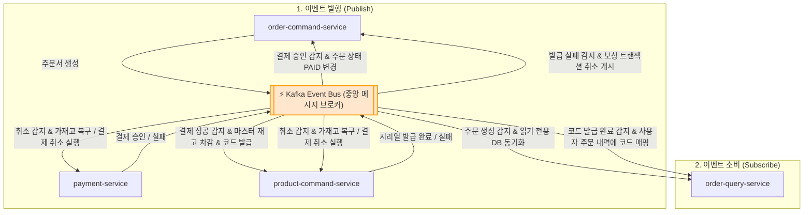

### 📝 카프카 토픽 및 이벤트 명세

1. **`order-created`**
   - **발행**: `order-command-service` (주문 접수 및 가재고 차감 완료 시)
   - **소비**: `order-query-service` (사용자 주문 내역의 읽기 모델에 새로운 주문 추가)
2. **`payment-approved` / `payment-failed`**
   - **발행**: `payment-service` (PG사 실결제 승인 완료 혹은 최종 실패 시)
   - **소비**: `order-command-service` (주문서 상태를 `PAID`로 변경하거나, 실패 시 가재고를 복구하고 주문 취소)
3. **`order-completed`**
   - **발행**: `order-command-service` (결제 승인이 완료되어 최종 주문 완료 처리 시)
   - **소비**: `product-command-service` (실제 상품의 마스터 재고를 감산하고, 구매 수량만큼의 게임 시리얼 코드를 즉시 발급 선점)
4. **`order-items-completed`**
   - **발행**: `product-command-service` (실제 마스터 재고 감산 및 게임 코드 발급 완료 시)
   - **소비**: `order-query-service` (주문 읽기 전용 모델에 발급된 게임 시리얼 키 정보를 추가하여 사용자가 마이페이지에서 즉시 조회 가능하도록 연동)
5. **`payment-cancel-requested`**
   - **발행**: `order-command-service` (배송 오류 또는 관리자 취소 시)
   - **소비**: `product-command-service` (마스터 재고를 복구하고 발급했던 시리얼 코드를 미판매 상태로 전환), `payment-service` (토스페이먼츠 승인 취소/환불 API 연동 실행)
6. **`order-delivery-failed`**
   - **발행**: `product-command-service` (주문 완료 이벤트를 받았으나 발급 가능한 게임 코드가 부족한 특수 예외 상황 시)
   - **소비**: `order-command-service` (주문 상태를 `CANCELLED`로 변경하고 보상 트랜잭션 개시)

---

## 📡 8. 카프카 브로커, 파티션 및 컨슈머 그룹 아키텍처 (Kafka Internal Architecture)

MSA 분산 환경에서 이벤트의 **신뢰성 있는 순서 보장(Ordering)**과 **처리 확장성(Scale-out)**을 실현하기 위해 카프카 내부 아키텍처를 다음과 같이 설계하고 운용합니다.

### 🔄 카프카 브로커, 파티션 및 컨슈머 분배 구조도

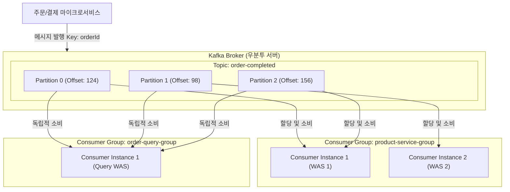

### 🔑 핵심 동작 개념 및 설계 방식

1. **카프카 브로커 (Kafka Broker)**:
   - 카프카 클러스터의 개별 서버 노드로, 메시지(이벤트)를 안전하게 수신, 디스크에 영속화, 컨슈머에게 전달합니다. 본 프로젝트는 우분투 서버 상에 싱글 브로커를 배포하여 사용하고 있습니다.

2. **토픽과 파티션 (Topic & Partition) - 순서 보장**:
   - 하나의 토픽(Topic)은 대용량 병렬 처리를 위해 여러 개의 **파티션(Partition)**으로 분할되어 저장됩니다.
   - **순서 보장 비결 (Message Key Hashing)**: 메시지 전송 시 상품 ID 또는 주문 ID(`orderId`)를 **메시지 키(Key)**로 지정합니다. 카프카는 이 키를 해싱하여 항상 동일한 파티션으로만 이벤트를 보냅니다. 파티션 내부에서는 메시지가 들어온 순서대로 큐처럼 정렬되므로, **동일 주문 건에 대한 이벤트(생성 $\rightarrow$ 결제 완료 $\rightarrow$ 발급)의 처리 순서가 100% 보장**됩니다.

3. **컨슈머 그룹 (Consumer Group) - 데이터 정합성 및 분산 처리**:
   - 동일한 비즈니스 책임을 가진 마이크로서비스 인스턴스들은 하나의 **컨슈머 그룹(Consumer Group)**으로 묶입니다. (예: `product-service-group`).
   - **1파티션 - 1컨슈머 할당 규칙**: 하나의 파티션은 동일 컨슈머 그룹 내에서 최대 하나의 컨슈머 인스턴스에만 할당됩니다. 이 규칙 덕분에 데이터 동시 읽기로 인한 중복 처리 및 상태 꼬임 현상이 근본적으로 예방됩니다.
   - **독립적 소비**: 서비스 성격이 다르면 서로 다른 컨슈머 그룹을 사용하여 동일한 토픽의 데이터를 각자의 오프셋으로 독립적으로 소비합니다. (예: 상품 재고를 처리하는 `product-service-group`과 읽기 전용 뷰를 생성하는 `order-query-group`은 독립적으로 메시지를 소비).

4. **오프셋 (Offset) - 장애 복구 및 위치 추적**:
   - 컨슈머가 파티션 내에서 메시지를 어디까지 읽었는지 나타내는 논리적인 위치 포인터입니다.
   - 컨슈머가 이벤트를 성공적으로 처리한 후 오프셋을 **커밋(Commit)**하면 카프카 브로커에 저장되며, 만약 컨슈머 서버가 다운되었다가 재시작되어도 **마지막으로 커밋된 오프셋 위치부터 안전하게 이벤트를 다시 읽어 처리(장애 복구)**할 수 있습니다.

---

## 📊 9. 동시성 제어 검증 방안 (Load Testing)

본 프로젝트는 고성능 성능 테스트 툴인 **Artillery**를 사용하여 실전 부하 환경에서 동시성 제어가 성공적으로 이루어지는지 검증합니다.

1. **테스트 설정**:
   - 상품의 최초 재고: **50개**
   - 동시 접속 가상 사용자: **100명** (각 유저별 고유 JWT 토큰 발급)
   - 각 사용자당 구매 시도 수량: **1개**

2. **예상 및 정상 검증 결과**:
   - 최초 요청 50건: **성공 (200 OK, 재고 선점 완료)**
   - 이후 요청 50건: **실패 (400 Bad Request, 재고 부족 예외 발생)**
   - 최종 DB 검증:
     

---

## 🗄️ 10. 마이크로서비스별 ERD 도식화 (Microservice ERD Diagrams)

본 프로젝트는 서비스 간의 독립성을 보장하기 위해 **Database-per-Service** 패턴을 적용했습니다. 각 마이크로서비스는 독립적인 PostgreSQL 데이터베이스를 사용하며, 필요한 타 도메인의 데이터는 **Kafka 이벤트 비동기 동기화**를 통해 로컬 읽기 전용 캐시 테이블(`readonly_products` 등)에 저장하여 사용합니다.

아래는 각 마이크로서비스의 물리/논리 엔터티 및 관계를 나타낸 ERD입니다.

---

### 1) `auth-service` 데이터베이스 (`shop_auth`)

사용자 인증 및 계정 정보를 관리합니다.

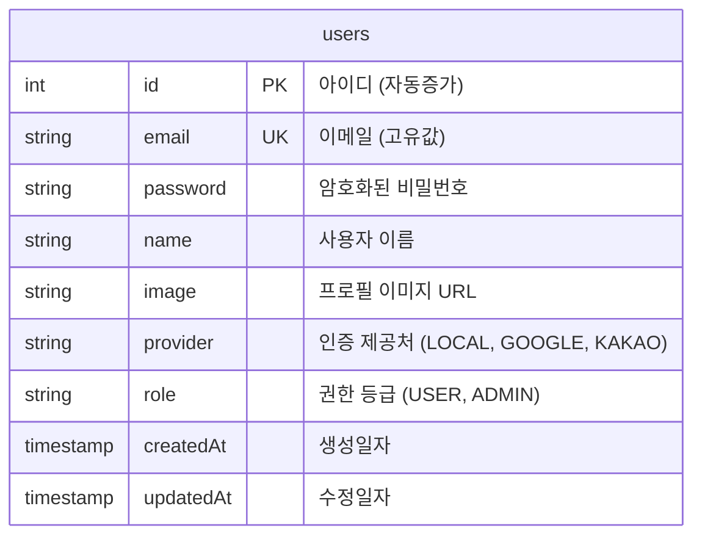

---

### 2) `cart-service` 데이터베이스 (`shop_cart`)

사용자의 장바구니 품목을 저장합니다. 상품명과 가격 조회를 위해 가볍게 동기화된 상품 캐시 테이블을 가집니다.

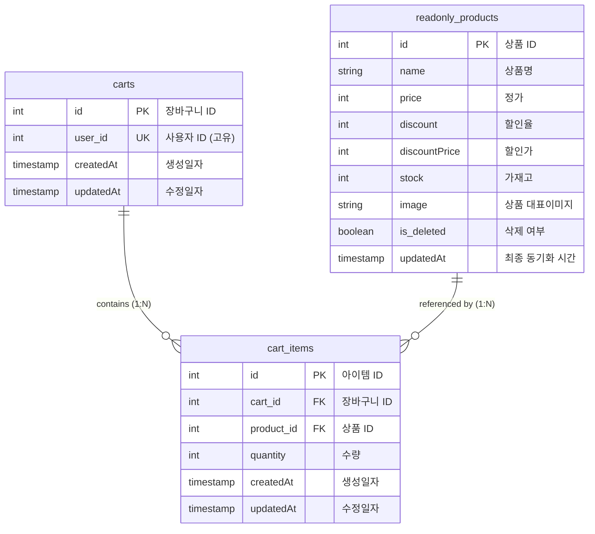

---

### 3) `wishlist-service` 데이터베이스 (`shop_wishlist`)

사용자가 찜해놓은 상품 목록을 보관합니다.

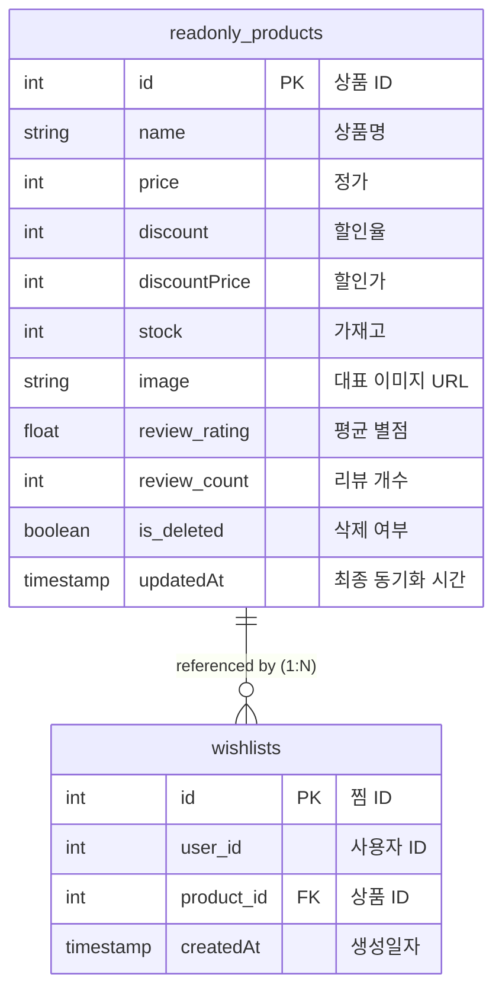

---

### 4) `order-query-service` 데이터베이스 (`shop_order_query`)

CQRS의 Read-model로써, 복잡한 Join 없이 마이페이지 등에서 초고속 조회가 가능하도록 주문 아이템 목록을 **JSON 역정규화 필드**로 통째로 저장합니다.

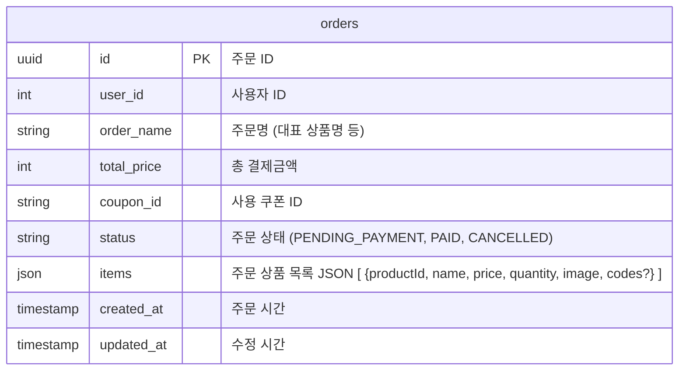

---

### 5) `product-query-service` 데이터베이스 (`shop_product_query`)

CQRS Read-model이며 상품 목록 검색 필터링 및 디테일 뷰를 처리합니다. JSON spec과 이미지 배열을 내포합니다.

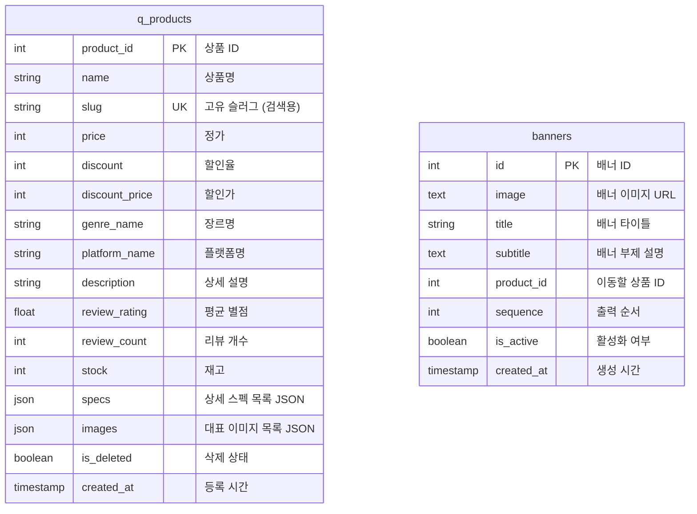

---

### 6) `product-command-service` 및 `review-service` 공유 데이터베이스 (`shop_product_command`)

상품의 CUD 작업, 게임 시리얼 코드 관리, 리뷰 등록 마스터 테이블을 가집니다. `review-service`는 이 데이터베이스에 직접 연결해 읽기/쓰기를 분담합니다.

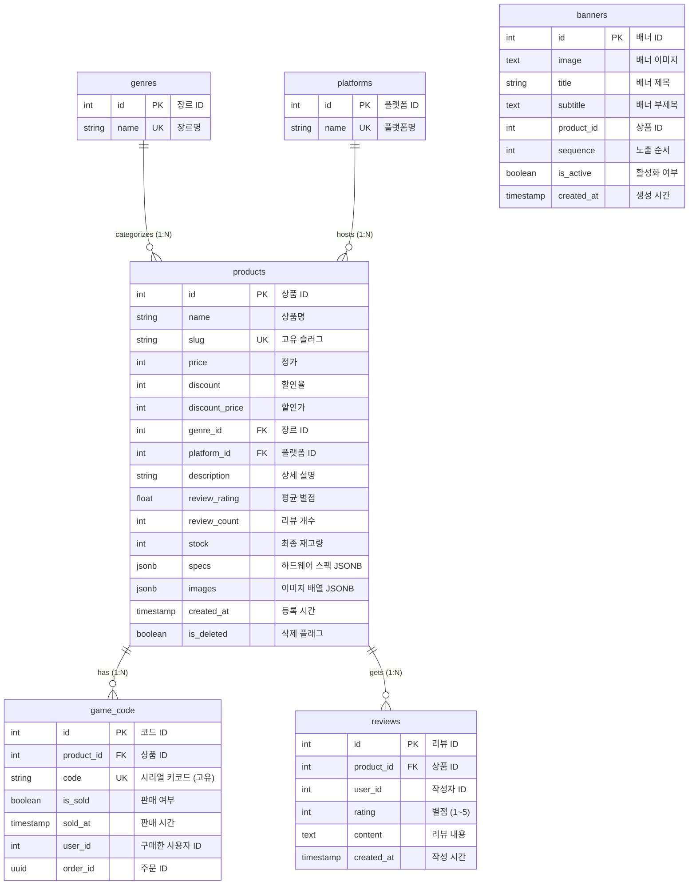

---

### 7) `order-command-service` 데이터베이스 (`shop_order_command`)

주문 접수(CUD) 트랜잭션의 마스터 데이터베이스입니다. 주문 처리 도중 재고 확인 및 분산 락 선점을 위해 가벼운 상품 복제본 테이블을 가집니다.

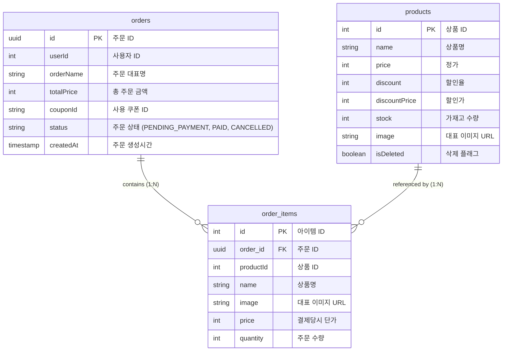

---

### 8) `payment-service` 데이터베이스 (`shop_payment`)

결제 내역 및 Toss PG사와의 결제 성공 상태를 독립적으로 영속화하여 관리합니다.

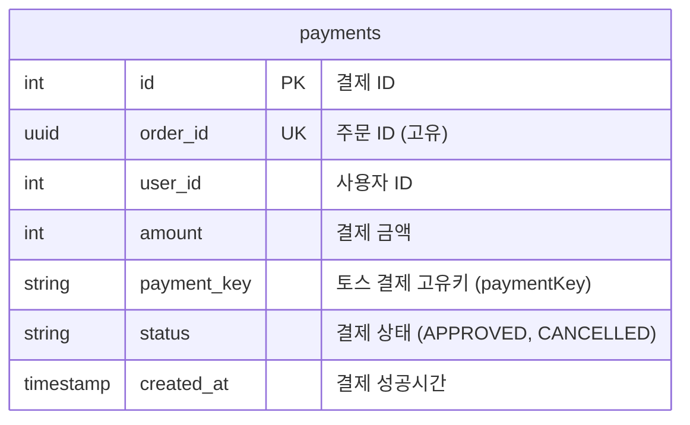
